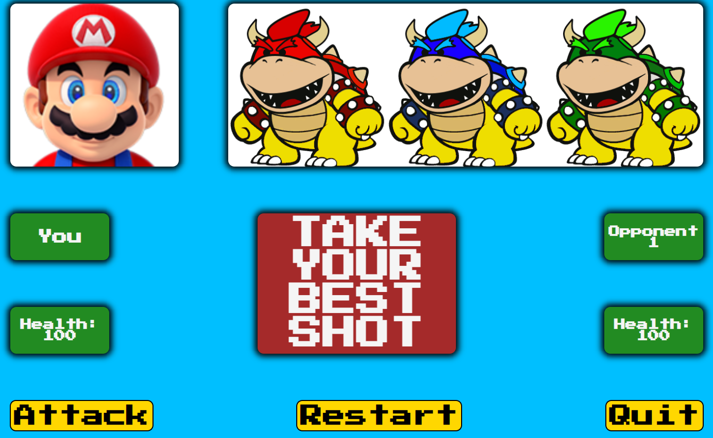

# Take Your Best Shot

## Description
This is a game in which the user's character (aka You) engages in simulated combat with three automated characters (Opponents 1-3) in sequence.    

I have used HTML, CSS and JavaScript to make the game.  Below is a picture of the home screen.

At the start of the game all four characters are given health values of 100 and power values that are randomly generated.  The You character gets a power value between 40 and 90, whereas the opponents get values between 10 and 60.  This owes to 1) the fact that there are three opponents for You to fight, and 2) the fact that it gives You a good chance to win, which seems advantageous for demonstration purposes.  After this project has been submitted and presented I may change the numbers to make the game harder to win. 

DOM manipulation is used to explain the game's concept and to document the game's progress.

Each fight is a series of rounds.  Each round is an attack-counterattack sequence, with You always going first.  

The outcome of every round hinges on the fighters' power values.  The fighter with the higher value causes greater reduction of the other fighter's health.  If You has the greater power value, then their attacks/counterattacks reduce the opponent's health by 30 - 40 points each time; whereas the opponent's attacks/counterattacks reduce You's health by 10 - 20 points.  Each health reduction is randomly generated.  The fighters' health levels are updated after each round.  

The rounds continue until one fighter's health falls below 1.  If You loses the fight, the game is over.  If You wins, they fight the next opponent.  If You defeats all three opponents, You wins the game.

You also has the options of starting a new game and quitting the game.

## History
This game was created to meet the requirements of a project assignment in a Per Scholas software engineering boot camp.  My first idea for the project was a game in which the user picks a character from a list (I was thinking along the lines of skeleton, vampire, werewolf, etc.) and then has their character "fight" a computer-generated character from the same list or an entirely different one (orc, elf, goblin; Sith Lord, Jedi Knight, stormtrooper; the possibilities are many).  The fighting would mirror the mechanisms of TYBS. 

It seemed (and still seems) like a good idea.  But I couldn't get excited about it and I quickly abandoned it in favor of TYBS.  Simpler setup, simpler algorithm for determining who wins each fight. 

It was not my intention to borrow imagery from Nintendo for TYBS, but representing the user's character with a certain beloved plumber gave the game a light-hearted feel that appealed to me.  After that it made sense to represent You's opponents with a trio of antagonists from the same magical kingdom.  It also encouraged me to limit the game to three opponents.  I'd originally planned on four to six.

Coding the attack-counterattack mechanism was easier than I expected it to be.  I was aided by being able to refer to an earlier project with a similar mechanism.  Nested if statements are not much fun to stare at for hours at a time, but eventually, line by line, this part of the game came together and held up to testing.

The bigger challenge was getting the look right.  I drew what I wanted on a piece of paper: rectangles within rectangles, a collection of containers for my images and text, plus three buttons to control the game.  Initially I calculated I'd need 14 divs; I think the final number is a bit smaller.  I created my divs in HTML and then set about styling them with CSS.  Reproducing my hand-drawn layout took time and patience.

The final task was to incorporate event listeners and DOM manipulation.  With that functionality was in place, TYBS started to feel like a real game.

I wanted to use modals for in-game messaging, but I was never happy with how the modals fit into the larger scheme of the game and look of the page.  That led me to use alerts instead, and they worked well.  And yet...visually, the alerts didn't gibe with the rest of the graphical elements.  They stood out in the wrong way.  That led me to tinker with displaying messages in the 'message-board' div, aka the big red rectangle in the center of the page.  (Fun fact:  the actual color of that rectangle is brown.)  The key to making that work was using Set Timeout to keep messages on-screen long enough to be read.  

## Miscellaneous
To play the game, navigate to the URL below.  If you want access to the files you can fork and clone this repository to your machine.

The live site for this game is https://johnvresilovic.github.io/mod1/

Thanks to my Per Scholas instructors, Tishana Trainor, Kasper Kain and Chase Van Halen, as well as my classmates in Cycle 28.

Contact info: johnvresilovic@protonmail.com